<p align="center"></p>
<p align="center"></p>
<h3 align="center">Showcase your skills on your GitHub or resumé with ease!</h3>
<hr>

# Credits

This project is based on the original work by [tandpfun/skill-icons](https://github.com/tandpfun/skill-icons).

# What This Fork Is For

This fork is focused on custom icon management so anyone can:

1. Use icons directly from this repository in GitHub READMEs.
2. Add new icons in batches from image files.
3. Generate themed and non-themed icon variants with consistent radius and padding.

# Use Icons In Your README

You can use icons by linking directly to files in this repository.

Example (raw GitHub URL):

```html


```

Example (jsDelivr URL):

```html

```

# Fork And Add Your Own Icons

1. Fork this repository.
2. Clone your fork.
3. Add source images into one of the upload folders.
4. Run one command to generate and rebuild icon metadata.
5. Use your own fork URL in your profile README.

## Quick Start

1. Drop image files (`.webp`, `.png`, `.jpg`, `.jpeg`, or `.svg`) into one of these folders:

```text
uploading/
	themed/
	light-only/
	dark-only/
```

2. Run:

```bash
npm run icons:upload:batch -- --upload-root uploading --output icons --size 256 --radius 60 --padding 24 --dark '#242938' --light '#F4F2ED'
```

3. Commit generated files from `icons/`.
4. Done: this command also rebuilds `dist/icons.json` and refreshes the Icons List section in this README.

## One Command For All Upload Folders

Use one command to process all upload queues at once:

```bash
npm run icons:upload:batch -- --upload-root uploading --output icons --size 256 --radius 60 --padding 24 --dark '#242938' --light '#F4F2ED'
```

Folder behavior:

1. `uploading/themed/` generates `Name-Dark.svg` and `Name-Light.svg`.
2. `uploading/light-only/` generates `Name-Light.svg` only.
3. `uploading/dark-only/` generates `Name-Dark.svg` only.

This command also rebuilds `dist/icons.json`, syncs the README Icons List, and deletes processed upload files after success.

Add `--no-cleanup` to keep source files.

Use `--dry-run` to preview outputs without generating files:

```bash
npm run icons:upload:batch -- --upload-root uploading --dry-run
```

# Icon Naming Notes

1. The icon ID is the lowercase filename (without extension).
2. Use `Name-Dark.svg` and `Name-Light.svg` for themed pairs.
3. Use `Name-Light.svg` or `Name-Dark.svg` when adding single-theme variants.

# README Icon List Automation

The upload batch command already refreshes the **Icons List** automatically.

You can still run this command manually any time you want to regenerate the list from files in `icons/`:

```bash
npm run icons:readme:sync
```

Rules used by the generator:

1. No duplicate IDs for light/dark pairs.
2. Prefer `-Light` when both `-Light` and `-Dark` exist.
3. If no `-Light` exists, use plain (`Name.svg`) or `-Dark` as fallback.

# Icons List

Here's a list of all the icons currently supported. Feel free to open an issue to suggest icons to add!

<a id="icons-jump"></a>

Jump to:
[A](#icons-a) | [B](#icons-b) | [C](#icons-c) | [D](#icons-d) | [E](#icons-e) | [F](#icons-f) | [G](#icons-g) | [H](#icons-h) | [I](#icons-i) | [J](#icons-j) | [K](#icons-k) | [L](#icons-l) | [M](#icons-m) | [N](#icons-n) | [O](#icons-o) | [P](#icons-p) | [Q](#icons-q) | [R](#icons-r) | [S](#icons-s) | [T](#icons-t) | [U](#icons-u) | [V](#icons-v) | [W](#icons-w) | [X](#icons-x) | [Y](#icons-y) | [Z](#icons-z)

<a id="icons-a"></a>
## A

[Back to top](#icons-jump)

|      Icon ID       |                         Icon                          |
| :----------------: | :---------------------------------------------------: |
| `ableton` |  |
| `activitypub` |  |
| `actix` |  |
| `adonis` |  |
| `aftereffects` |  |
| `aiscript` |  |
| `alpinejs` |  |
| `anaconda` |  |
| `android` |  |
| `androidstudio` |  |
| `angular` |  |
| `ansible` |  |
| `apollo` |  |
| `apple` |  |
| `appwrite` |  |
| `arch` |  |
| `arduino` |  |
| `astro` |  |
| `atom` |  |
| `audition` |  |
| `autocad` |  |
| `aws` |  |
| `azul` |  |
| `azure` |  |

<a id="icons-b"></a>
## B

[Back to top](#icons-jump)

|      Icon ID       |                         Icon                          |
| :----------------: | :---------------------------------------------------: |
| `babel` |  |
| `bash` |  |
| `bevy` |  |
| `bitbucket` |  |
| `blender` |  |
| `bootstrap` |  |
| `bsd` |  |
| `bun` |  |

<a id="icons-c"></a>
## C

[Back to top](#icons-jump)

|      Icon ID       |                         Icon                          |
| :----------------: | :---------------------------------------------------: |
| `c` |  |
| `cassandra` |  |
| `chatgpt` | 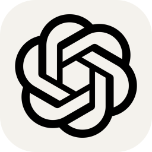 |
| `claude` |  |
| `clion` |  |
| `clojure` |  |
| `cloudflare` |  |
| `cmake` |  |
| `codepen` |  |
| `coffeescript` |  |
| `copilot` | 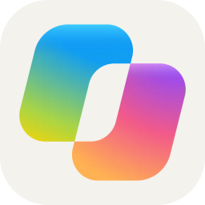 |
| `cpp` |  |
| `crystal` |  |
| `cs` |  |
| `css` |  |
| `cursor` | 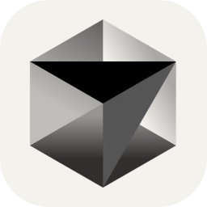 |
| `cypress` |  |

<a id="icons-d"></a>
## D

[Back to top](#icons-jump)

|      Icon ID       |                         Icon                          |
| :----------------: | :---------------------------------------------------: |
| `d3` |  |
| `dart` |  |
| `debian` |  |
| `deepseek` |  |
| `deno` |  |
| `devto` |  |
| `discord` |  |
| `discordbots` |  |
| `discordjs` |  |
| `django` |  |
| `docker` |  |
| `dotnet` |  |
| `dynamodb` |  |

<a id="icons-e"></a>
## E

[Back to top](#icons-jump)

|      Icon ID       |                         Icon                          |
| :----------------: | :---------------------------------------------------: |
| `eclipse` |  |
| `elasticsearch` |  |
| `electron` |  |
| `elevenlabs` |  |
| `elixir` |  |
| `elysia` |  |
| `emacs` |  |
| `ember` |  |
| `emotion` |  |
| `expressjs` |  |

<a id="icons-f"></a>
## F

[Back to top](#icons-jump)

|      Icon ID       |                         Icon                          |
| :----------------: | :---------------------------------------------------: |
| `fastapi` |  |
| `fediverse` |  |
| `figma` |  |
| `firebase` |  |
| `flask` |  |
| `flutter` |  |
| `forth` |  |
| `fortran` |  |

<a id="icons-g"></a>
## G

[Back to top](#icons-jump)

|      Icon ID       |                         Icon                          |
| :----------------: | :---------------------------------------------------: |
| `gamemakerstudio` |  |
| `gatsby` |  |
| `gcp` |  |
| `gemini` | 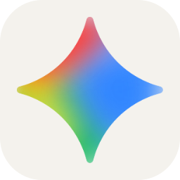 |
| `gherkin` |  |
| `git` |  |
| `github` |  |
| `githubactions` |  |
| `githubcopilot` | 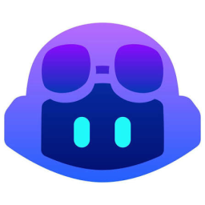 |
| `gitlab` |  |
| `gmail` |  |
| `godot` |  |
| `golang` |  |
| `gradle` |  |
| `grafana` |  |
| `graphql` |  |
| `grok` | 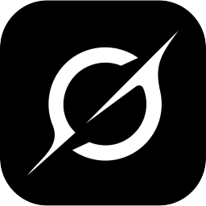 |
| `gtk` |  |
| `gulp` |  |

<a id="icons-h"></a>
## H

[Back to top](#icons-jump)

|      Icon ID       |                         Icon                          |
| :----------------: | :---------------------------------------------------: |
| `haskell` |  |
| `haxe` |  |
| `haxeflixel` |  |
| `heroku` |  |
| `hibernate` |  |
| `html` |  |
| `htmx` |  |
| `huggingface` |  |

<a id="icons-i"></a>
## I

[Back to top](#icons-jump)

|      Icon ID       |                         Icon                          |
| :----------------: | :---------------------------------------------------: |
| `idea` |  |
| `illustrator` |  |
| `instagram` |  |
| `ipfs` |  |

<a id="icons-j"></a>
## J

[Back to top](#icons-jump)

|      Icon ID       |                         Icon                          |
| :----------------: | :---------------------------------------------------: |
| `java` |  |
| `javascript` |  |
| `jenkins` |  |
| `jest` |  |
| `jquery` |  |
| `julia` |  |

<a id="icons-k"></a>
## K

[Back to top](#icons-jump)

|      Icon ID       |                         Icon                          |
| :----------------: | :---------------------------------------------------: |
| `kafka` |  |
| `kali` |  |
| `kotlin` |  |
| `ktor` |  |
| `kubernetes` |  |

<a id="icons-l"></a>
## L

[Back to top](#icons-jump)

|      Icon ID       |                         Icon                          |
| :----------------: | :---------------------------------------------------: |
| `laravel` |  |
| `latex` |  |
| `less` |  |
| `linkedin` |  |
| `linux` |  |
| `lit` |  |
| `lovable` | 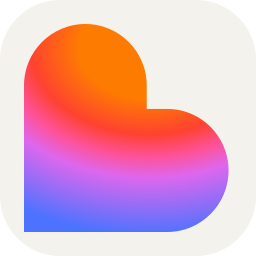 |
| `lua` |  |

<a id="icons-m"></a>
## M

[Back to top](#icons-jump)

|      Icon ID       |                         Icon                          |
| :----------------: | :---------------------------------------------------: |
| `markdown` |  |
| `mastodon` |  |
| `materialui` |  |
| `matlab` |  |
| `maven` |  |
| `meta` | 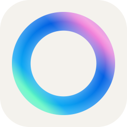 |
| `midjourney` |  |
| `mint` |  |
| `misskey` |  |
| `mongodb` |  |
| `mysql` |  |

<a id="icons-n"></a>
## N

[Back to top](#icons-jump)

|      Icon ID       |                         Icon                          |
| :----------------: | :---------------------------------------------------: |
| `neovim` |  |
| `nestjs` |  |
| `netlify` |  |
| `nextjs` |  |
| `nginx` |  |
| `nim` |  |
| `nix` |  |
| `nodejs` |  |
| `notebooklm` |  |
| `notion` |  |
| `npm` |  |
| `nuxtjs` |  |

<a id="icons-o"></a>
## O

[Back to top](#icons-jump)

|      Icon ID       |                         Icon                          |
| :----------------: | :---------------------------------------------------: |
| `obsidian` |  |
| `ocaml` |  |
| `octave` |  |
| `opencv` |  |
| `openshift` |  |
| `openstack` |  |

<a id="icons-p"></a>
## P

[Back to top](#icons-jump)

|      Icon ID       |                         Icon                          |
| :----------------: | :---------------------------------------------------: |
| `p5js` |  |
| `perl` |  |
| `perplexity` | 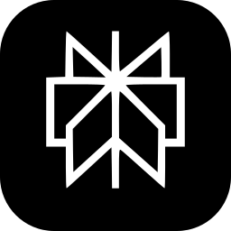 |
| `photoshop` |  |
| `php` |  |
| `phpstorm` |  |
| `pinia` |  |
| `pkl` |  |
| `plan9` |  |
| `planetscale` |  |
| `pnpm` |  |
| `postgresql` |  |
| `postman` |  |
| `powershell` |  |
| `premiere` |  |
| `prisma` |  |
| `processing` |  |
| `prometheus` |  |
| `pug` |  |
| `pycharm` |  |
| `python` |  |
| `pytorch` |  |

<a id="icons-q"></a>
## Q

[Back to top](#icons-jump)

|      Icon ID       |                         Icon                          |
| :----------------: | :---------------------------------------------------: |
| `qt` |  |
| `qwen` | 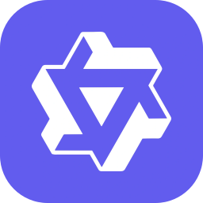 |

<a id="icons-r"></a>
## R

[Back to top](#icons-jump)

|      Icon ID       |                         Icon                          |
| :----------------: | :---------------------------------------------------: |
| `r` |  |
| `rabbitmq` |  |
| `rails` |  |
| `raspberrypi` |  |
| `react` |  |
| `reactivex` |  |
| `redhat` |  |
| `redis` |  |
| `redux` |  |
| `regex` |  |
| `remix` |  |
| `replit` |  |
| `rider` |  |
| `robloxstudio` |  |
| `rocket` |  |
| `rollupjs` |  |
| `ros` |  |
| `ruby` |  |
| `rust` |  |

<a id="icons-s"></a>
## S

[Back to top](#icons-jump)

|      Icon ID       |                         Icon                          |
| :----------------: | :---------------------------------------------------: |
| `sass` |  |
| `scala` |  |
| `scikitlearn` |  |
| `selenium` |  |
| `sentry` |  |
| `sequelize` |  |
| `siri` | 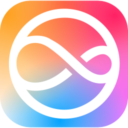 |
| `sketchup` |  |
| `solidity` |  |
| `solidjs` |  |
| `spotify` |  |
| `spring` |  |
| `sqlite` |  |
| `stackoverflow` |  |
| `styledcomponents` |  |
| `sublime` |  |
| `supabase` |  |
| `svelte` |  |
| `svg` |  |
| `swift` |  |
| `symfony` |  |

<a id="icons-t"></a>
## T

[Back to top](#icons-jump)

|      Icon ID       |                         Icon                          |
| :----------------: | :---------------------------------------------------: |
| `tailwindcss` |  |
| `tauri` |  |
| `tensorflow` |  |
| `terraform` |  |
| `threejs` |  |
| `twitter` |  |
| `typescript` |  |

<a id="icons-u"></a>
## U

[Back to top](#icons-jump)

|      Icon ID       |                         Icon                          |
| :----------------: | :---------------------------------------------------: |
| `ubuntu` |  |
| `unity` |  |
| `unrealengine` |  |

<a id="icons-v"></a>
## V

[Back to top](#icons-jump)

|      Icon ID       |                         Icon                          |
| :----------------: | :---------------------------------------------------: |
| `v` |  |
| `vala` |  |
| `vercel` |  |
| `verilog` |  |
| `vim` |  |
| `visualstudio` |  |
| `vite` |  |
| `vitest` |  |
| `vscode` |  |
| `vscodium` |  |
| `vuejs` |  |
| `vuetify` |  |

<a id="icons-w"></a>
## W

[Back to top](#icons-jump)

|      Icon ID       |                         Icon                          |
| :----------------: | :---------------------------------------------------: |
| `webassembly` |  |
| `webflow` |  |
| `webpack` |  |
| `webstorm` |  |
| `windicss` |  |
| `windows` |  |
| `wordpress` |  |
| `workers` |  |

<a id="icons-x"></a>
## X

[Back to top](#icons-jump)

|      Icon ID       |                         Icon                          |
| :----------------: | :---------------------------------------------------: |
| `xd` |  |

<a id="icons-y"></a>
## Y

[Back to top](#icons-jump)

|      Icon ID       |                         Icon                          |
| :----------------: | :---------------------------------------------------: |
| `yarn` |  |
| `yew` |  |

<a id="icons-z"></a>
## Z

[Back to top](#icons-jump)

|      Icon ID       |                         Icon                          |
| :----------------: | :---------------------------------------------------: |
| `zig` |  |
---

## 💖 Support the Original Creator

This fork is based on the original project by tandpfun. If you would like to support the original creator's open source work, you can buy them a coffee here:

<a href='https://ko-fi.com/Q5Q860KQ2' target='_blank'></a>

You can also support this fork by opening icon requests, reporting issues, or contributing improvements.
